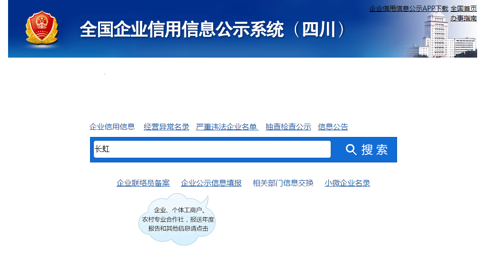
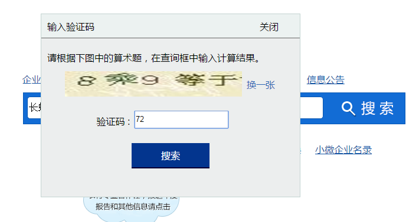
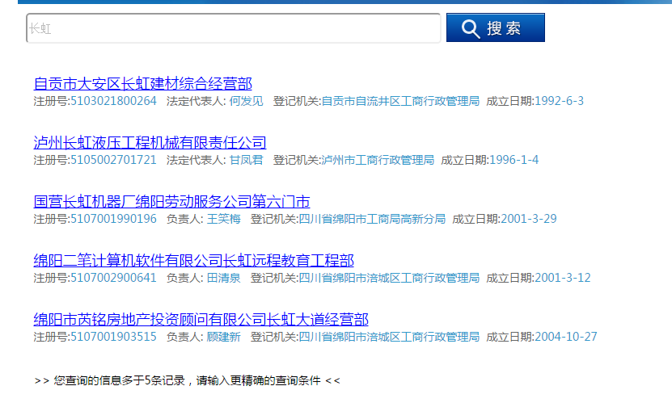
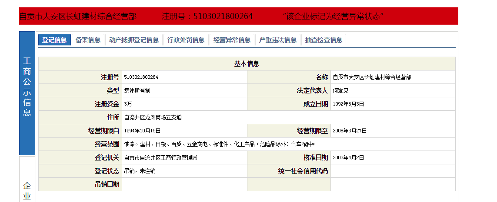
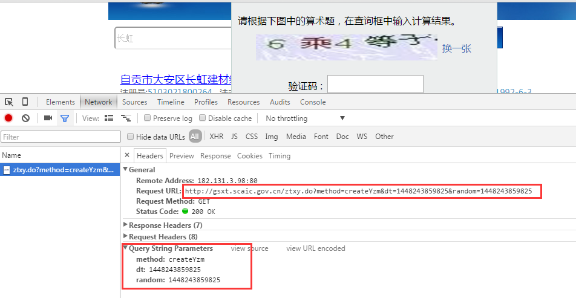
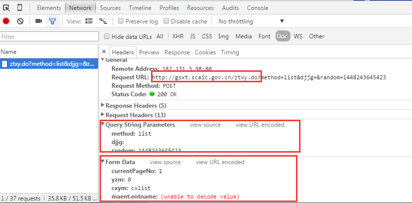
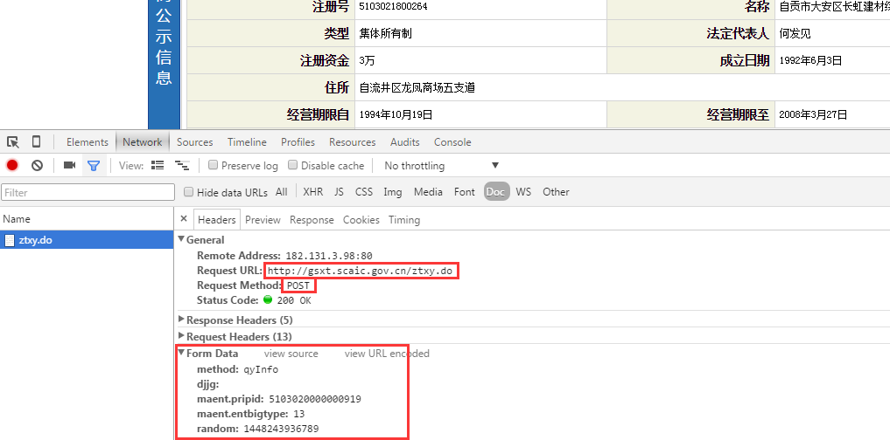

# 数据抓取之数据抓取流程

公司的数据抓取系统也写了一阵子了，是时候总结下了，不然凭我的记性，过一段时间就忘的差不多了。打算写一个系列将其中踩过的坑都记录下来。暂时定一个目录，按照这个系列来写：

- 数据抓取流程，以公示网四川为例子，介绍整个数据抓取工作的流程
- 反爬虫规则：验证码识别，介绍easyocr和uuwise的使用
- 反爬虫规则：使用代理，和模拟浏览器头信息访问
- 数据存储方案
 
今天就先来说下数据抓取的大致工作流程.

先说下背景，公司是做企业征信服务的。整合各方面的数据来制作企业信用报告。主要数据来源，包括：从第三方购买（整体购买数据或者接口形式）；抓取网络公开的数据。
那么需要一个数据采集平台，以便可以方便，快速的增加新的数据对象进行采集。针对数据抓取平台的架构设计，我也是新手，以后一边学习一边总结这方面经验教训。这个系列先从实战出发，那么第一弹：数据抓取的整个流程。

我日常做数据抓取分为以下几个步骤：

- 明确数据采集需求；
- 分析要采集数据的url和相关参数；
- 编码。

咳咳...先不要扔鸡蛋，我知道有人觉得这三个步骤是我拿出来逗逼的。
但是，听我说完先。
## 明确数据采集需求
 先分享一个场景：
 
    - 产品经理：小张帅哥，我发现这个网站里面的数据对我们非常有用，你给抓取下来吧。
    - 小张：好啊，你要抓取那些数据呢
    - 产品经理：就这个页面的数据都要,这里的基本信息，这里的股东信息
    - 小张：呃，都要是吧，好
    - 产品经理：这个做好要多久啊，
    - 小张：应该不会太久，这些都是表格数据，好解析
    - 产品经理：好的，小张加油哦，做好了请你吃糖哦。
    - 然后小张开始写，写了一会儿小张脸上冒汗了：这怎么基本信息和其他信息还不是一个页面。这表格竟然是在后台画好的，通过js请求数据画在页面的,我去，不同省份的企业表面看着一样，其实标签不一样。这要一个一个省份去适配啊啊啊啊啊啊.
    - 小张同志开始加班加点，可还是没有按照和产平经理约定的时间完成任务

那么问题来了，为什么小张在苦逼的加班加点还没有完成任务。是因为产品经理没有把需求说清楚么？但是产品经理也说了，这个页面的都要啊。
问题在于：

- 1，产品经理说都要的时候，小张应该从技术的角度把那个要抓取的页面的“全部数据”了解清楚，因为产品经理的说的“全部数据”也许只是他看到的那些“全部”，产品经理看到的数据也许是a，b，c，而如果通过自己查看页面，也许还有隐藏的数据d，e，f，那么针对这些数据，如果产品经理看到的话，他要不要，这个需要小张去跟产品经理确认的。
- 2，针对产品经理说的需要要的数据，举个例子，比如要抓取的企业的基本信息中有有邮编，有省，市，县(区）三级地址。这个时候小张其实可以确认下，我们是否已经有有邮政编码和地区的对应表，那么有的话，我是不是可以不抓这些省市地区县数据呢，这个也可以跟产品经理确认清楚。可以看看这些省市区县数据是否规范，如果不规范，就更没有必要抓取了，而且即使抓取，后期可能还要进行清洗。而如果我们已经有邮编和地区的对照表的话，我们是完全没有必要抓取这些数据的
- 3，关于时间，如果产平经理要求有明确的的时间表，那么小张完全没有必要立即给出时间的，他完全可以先花几分钟，十几分钟，甚至几个小时先分析下页面解析难度，再给出时间的。相信我，有时候一个参数能让你纠结一天。

## 分析要采集数据的url和相关参数

- 其实如果这一步骤昨晚，基本上要花多少时间来解析数据已经可以估计八九不离十了。
- 其实现在浏览器有很多工具可以帮助我们分析的提交参数和响应数据，下面我以全国企业信用信息公示系统中四川省的数据抓取为例子来分析：
- 首先明确一下需求，我们只采集数据的基本登记信息，为什么要明确这点，因为：这个页面左侧有4个导航菜单，平均每个菜单中又有4到5个子菜单，而有的子菜单中又有不同类的数据，相信我如果你要全部解析，光准备测试数据都得花费一番功夫，因为模块虽然很多，单并不是所有企业的这些模块都有数据。

### 我先走完我要抓取数据所经过的流程，见下面四张图片：

- 1,输入搜索企业名称

- 2,输入验证码，点击搜索

- 3,搜索结果列表页面

- 4,点击一条企业名称，打开企业详情页面，看到基本登记信息

### 提取url和参数

从上面四张图来看，我们可以确定有如下几个连接需要处理：
- 1，获取验证码连接
- 2，提交查询
- 3，查看基本登记信息页面

那么我们来看看这三步的提交地址和参数分别是什么，这里我们使用chrome的开发者工具来进行页面分析。
类似的工具很多，各个浏览器自带的开发者工具基本都能满足需要，也可一使用一些第三方插件：如firebug,httpwatch等

- 1，我们看到验证码的地址和参数：

- 3，点击搜索的时候查看提交查询的地址和参数,注意提交的时候会看到有很多请求，比如页面肯定会请求很多静态资源，要学会过滤请求：

- 3，点击某一条企业名称，打开企业详情界面

## 编写代码实现功能

通过之前的步骤，我们已经提取出了要采集企业的基本登记信息，需要提交三次请求，每次提交的方法（POST or GET),以及提交的参数。
接下来就是用代码实现上述步骤，拿到你想要的数据即可。这篇文章不赘述代码实现的具体逻辑，因为本篇的重点还是在于说明：抓取一个网页的工作流程。
后期针对代码实现过程中用到的关键技术点和踩过到的坑会逐一总结。
暂时列出涉及到的相关内容：

- 反爬虫规则：验证码识别，介绍easyocr和uuwise的使用
- 反爬虫规则：使用代理
- 反爬虫规则：httpclient头信息
- 数据存储方式，介绍使用json存储在单字段以及优点和缺点